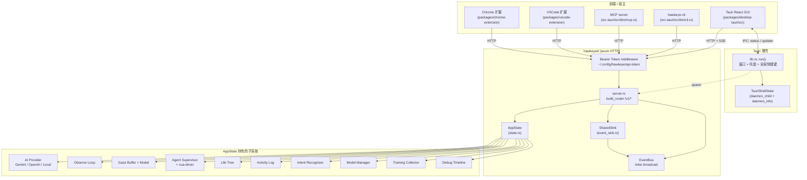
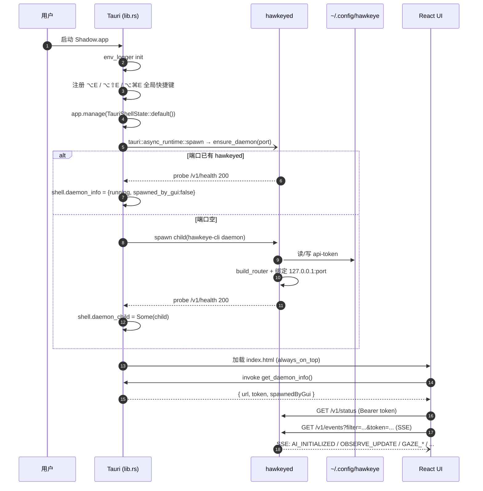
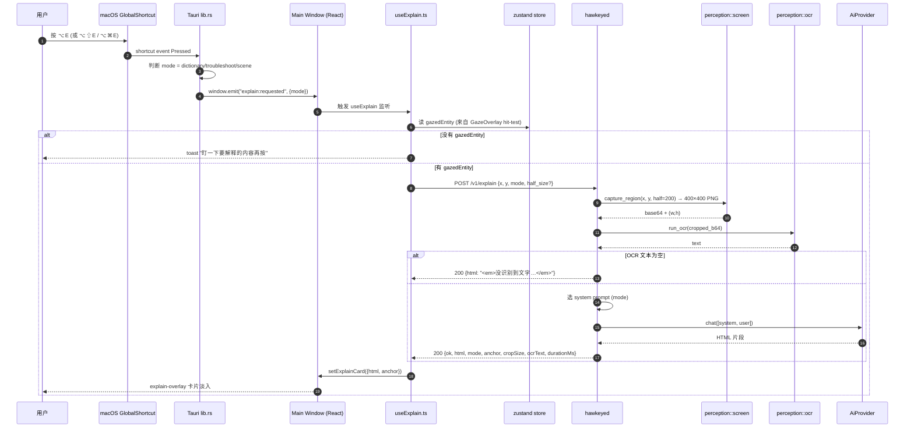
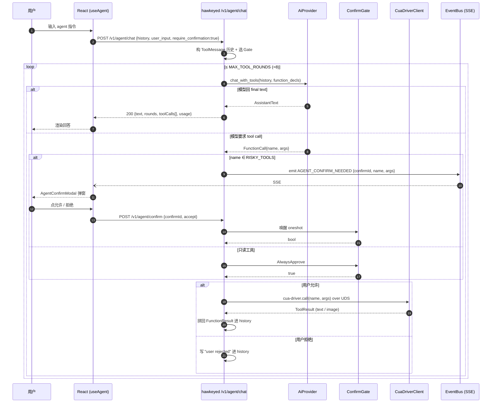
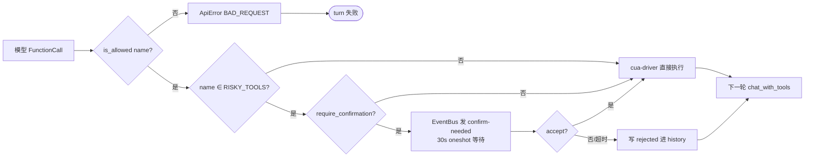
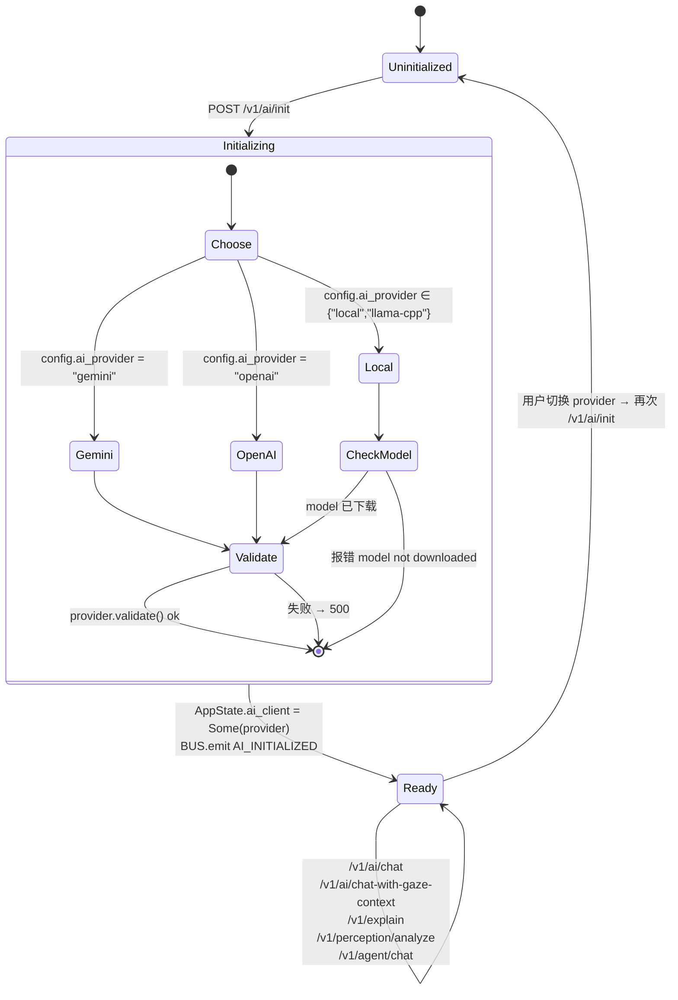
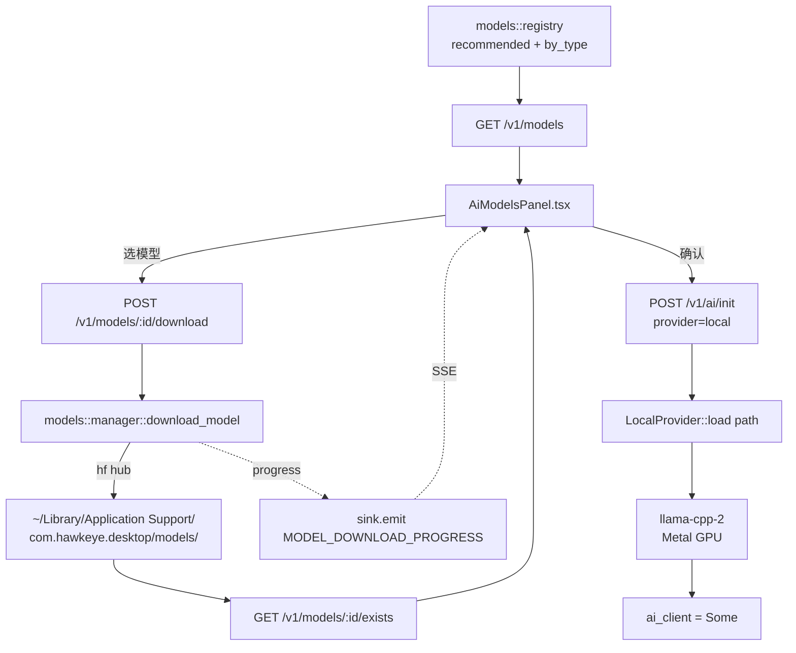
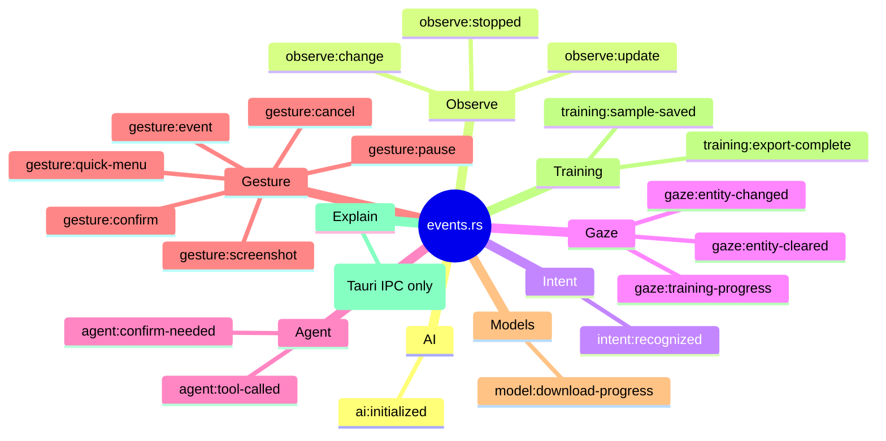
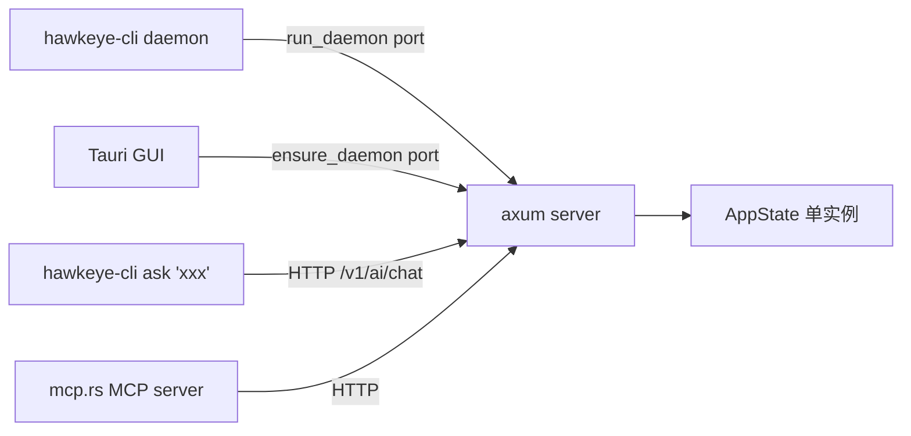

# Shadow 流程图（用 beautiful-mermaid 渲染）

本文件用 [beautiful-mermaid](https://github.com/lukilabs/beautiful-mermaid) 兼容的 Mermaid 语法画出 Shadow 当前所有关键流程。每张图都对应 `packages/desktop-tauri/` 下的真实代码路径。

> 渲染方式：
> ```ts
> import { renderMermaidSVG } from 'beautiful-mermaid'
> const svg = renderMermaidSVG(mermaidSource)   // 同步，返回 SVG 字符串
> const ascii = renderMermaidASCII(mermaidSource) // 同步，返回 Unicode/ASCII
> ```

---

## 0. 顶层组件全景

Shadow 经过 *HAWKEYED 统一* 之后：Tauri 只剩薄壳（窗口/托盘/快捷键），所有后端能力都搬到独立的 `hawkeyed` HTTP 守护进程，任何前端（GUI / CLI / MCP / VSCode 扩展 / Chrome 扩展）都通过 `localhost:<port>` 的 REST + SSE 接同一份 `AppState`。



---

## 1. 启动与守护进程握手

Tauri 启动后只做三件事：建窗口、注册三个 `⌥E` 系列快捷键、用 `daemon::ensure_daemon(port)` 探活/拉起 hawkeyed。Bearer Token 通过 GUI-only IPC `get_daemon_token` 在启动期一次性交给前端，后续浏览器内 `EventSource` 用 `?token=` 注入 Authorization。



---

## 2. Observe 主循环（自适应频率 + 感知合流）

`ObserveLoop::start` 启动一个 tokio task，循环里**先**问 `AdaptiveRefresh` 拿当前间隔（用户活跃 → 间隔短；空闲 → 间隔长），然后截屏、计算 8×8 灰度均值的 perceptual hash 做变化检测，只有 `change_ratio ≥ threshold` 才走 OCR + 活动窗口 + 意图识别 + Life Tree 更新。所有产物通过 `EventSink` 既写入 `AppState`（前端拉取）又广播到 SSE 总线（前端订阅）。

```mermaid
flowchart TD
  Start([POST /v1/observe/start]) --> Spawn[tokio::spawn run_loop]
  Spawn --> AdaptInt[读 adaptive_refresh.current_interval_ms]
  AdaptInt --> Sleep{select! sleep | stop_rx}
  Sleep -- stop --> Emit0[sink.emit OBSERVE_STOPPED] --> End([return])
  Sleep -- tick --> Cap[perception::screen::capture_screenshot]
  Cap -->|Err| AdaptInt
  Cap --> Decode[base64 → PNG → RGBA]
  Decode --> Hash[change_detector::compute_phash 8x8 灰度均值]
  Hash --> Cmp{change_ratio ≥ threshold?}
  Cmp -- 否 --> AdaptInt
  Cmp -- 是 --> EmitChg[sink.emit OBSERVE_CHANGE]
  EmitChg --> Rec[adaptive_refresh.record_activity ScreenChange]
  Rec --> Win[perception::window::get_active_window]
  Win --> OCR[perception::ocr::run_ocr<br/>Vision API via swift-ocr]
  OCR --> Build[组装 ObservationResult<br/>+ ocr_regions 给前端做 gaze hit-test]
  Build --> Log[activity_log.push ActivityEntry]
  Log --> Intent[intent_recognizer.recognize]
  Intent --> IntentE{识别到意图?}
  IntentE -- 是 --> EmitInt[sink.emit INTENT_RECOGNIZED]
  IntentE -- 否 --> Tree
  EmitInt --> Tree
  Tree[life_tree.process_activity] --> Store[state.last_observation = obs]
  Store --> EmitObs[sink.emit OBSERVE_UPDATE]
  EmitObs --> AdaptInt
```

`POST /v1/observe/stop` 调 `stop_tx.send(true)`，循环里 `stop_rx.changed()` 触发 → emit `OBSERVE_STOPPED` → 退出。

---

## 3. Look-to-Explain（注视即解释）

Shadow 的招牌交互：用户盯着屏幕某处，按 `⌥E / ⌥⇧E / ⌥⌘E` 切换 *词典 / 排错 / 场景* 三种 prompt，AI 返回纯 HTML 片段直接渲染在 explain-overlay 卡片里。



---

## 4. Gaze 追踪与在线训练

前端用 WebGazer 拿到眼部 ROI 特征 (40 维)，连续推到 `/v1/gaze/sample`。攒够 ≥10 个样本后调 `/v1/gaze/train`，daemon 在后台 spawn `gaze::ane_runner::run_training`（优先 Apple Neural Engine，回退 CPU）。训练好的 `GazeModel` 装进 `AppState`，之后 `/v1/gaze/predict` 30fps 出 (x, y)。前端拿到坐标后**在自己进程内**做命中测试（用最近一次 `ObservationResult.ocr_regions`），把命中实体写回 `/v1/gaze/entity`，进而被 `chat_with_gaze_context` 用来把 "这个 / that" 改写成 `「Foo」(button)`。

```mermaid
graph LR
  subgraph FE[前端 React]
    WG[WebGazer<br/>MediaPipe WASM]
    HG[useWebGazer.ts]
    HE[useGazedEntity.ts]
    OV[GazeOverlay.tsx]
  end

  subgraph D[hawkeyed]
    SB[POST /v1/gaze/sample<br/>→ GazeDataBuffer]
    PR[POST /v1/gaze/predict<br/>→ GazeModel.predict_timed]
    TR[POST /v1/gaze/train<br/>→ tokio::spawn run_training]
    AR[ane_runner.rs<br/>ANE > CPU fallback]
    GM[GazeModel<br/>(state.gaze_model)]
    ENT[PUT /v1/gaze/entity<br/>state.current_gazed_entity]
    CCG[POST /v1/ai/chat-with-gaze-context]
    OBS[state.last_observation<br/>ocr_regions]
  end

  WG -->|40-d 特征| HG
  HG -->|连续推流| SB
  HG -->|每帧| PR
  PR -->|(x,y)| OV
  OBS -.快照.-> HE
  OV --> HE
  HE -->|命中 OCR region| ENT
  ENT --> CCG
  CCG -. 改写代词 .- ENT

  SB -. 攒够样本 .- TR
  TR --> AR
  AR --> GM
  GM --> PR
```

训练状态机：

```mermaid
stateDiagram-v2
  [*] --> Empty: 首次启动
  Empty --> Buffering: POST /v1/gaze/sample
  Buffering --> Buffering: sample_count < 10
  Buffering --> Ready: ≥10 且未训练
  Ready --> Training: POST /v1/gaze/train
  Training --> Ready: ANE 训练完, model 更新
  Training --> Ready: 失败 (log::error, 旧 model 保留)
  Ready --> Predicting: POST /v1/gaze/predict
  Predicting --> Ready
  Ready --> Empty: DELETE /v1/gaze/model
```

---

## 5. Agent 工具调用（cua-driver 多轮循环）

`run_user_turn` 是单次用户回合的总指挥：把历史 + 新 user 输入交给 `AiProvider.chat_with_tools`，模型可能直接出 final text 也可能要求调用工具。如果是 `RISKY_TOOLS = [click, type_text, press_key, launch_app, scroll]` 之一，先过 `ConfirmGate`；GUI 模式下用 `EventBusConfirmGate` 发出 `agent:confirm-needed` 事件等用户在 `AgentConfirmModal` 里点 → 30s 超时。每次工具结果都回填给模型，最多 `MAX_TOOL_ROUNDS = 8` 轮。



风险闸门 + 工具白名单：



---

## 6. AI Provider 抽象与初始化

`/v1/ai/init` 看 `config.ai_provider` 选具体客户端，**统一** 实现 `AiProvider` trait（`chat / chat_with_vision / chat_with_tools / validate`）。本地模式走 `llama-cpp-2` + GGUF + Apple Metal，模型从 `models::manager` 下载。



本地模型生命周期：



---

## 7. 从屏幕到回答：端到端数据流

把第 2 节 Observe 产生的 `ObservationResult.ocr_regions` 当作 *屏幕语义索引*，把第 4 节 Gaze 的 (x, y) 当作 *用户当前焦点*，第 3/5 节再把焦点带进 prompt — 这是 Shadow 的核心闭环。

```mermaid
flowchart TD
  subgraph Sense[感知]
    SCR[screen capture] --> PH[perceptual hash]
    PH -->|changed| OCR2[OCR + regions]
    SCR --> CROP[capture_region<br/>固定 400×400]
  end

  subgraph Track[追踪]
    EYE[WebGazer 特征] --> SAM[/v1/gaze/sample]
    SAM --> BUF[GazeBuffer]
    BUF --> TRN[/v1/gaze/train<br/>ANE]
    TRN --> GM2[GazeModel]
    EYE --> PRED[/v1/gaze/predict]
    PRED --> XY[(x, y)]
  end

  subgraph Fuse[融合]
    OCR2 --> REG[ocr_regions]
    XY --> HIT[前端 hit-test]
    REG --> HIT
    HIT --> ENT[GazedEntity<br/>{text, type, bbox}]
  end

  subgraph Act[行动]
    ENT --> CHAT["/v1/ai/chat-with-gaze-context<br/>替换 这个/that"]
    ENT --> EXP["按 ⌥E → /v1/explain<br/>裁剪 + OCR + AI"]
    ENT --> AGT2["/v1/agent/chat<br/>带屏幕上下文调工具"]
    CHAT --> OUT[(回答)]
    EXP --> OUT
    AGT2 --> OUT
  end
```

---

## 8. 事件总线（SSE）所有事件分类

`EventBus` 是 `tokio::sync::broadcast<Frame{name,payload}>`，前端订阅 `GET /v1/events?filter=prefix1,prefix2`。下表是当前所有事件分组。



---

## 9. 命令行 & MCP 入口

同一个 daemon 由三种方式拉起／消费：



CLI / MCP / GUI **共享同一进程的同一 AppState** — 这就是 "为什么要 daemon 而不只 CLI" 的答案：观察循环、Life Tree、Gaze 模型这些有状态的东西每次冷启 CLI 会被毁掉，daemon 保证一次启动持续保温。

---

## 10. 一张图：所有入口 → 所有出口

```mermaid
graph TB
  classDef ent fill:#3b82f6,color:#fff
  classDef daemon fill:#10b981,color:#fff
  classDef store fill:#f59e0b,color:#fff
  classDef out fill:#ef4444,color:#fff

  subgraph IN[入口]
    K1["⌥E / ⌥⇧E / ⌥⌘E"]:::ent
    K2[Tray 菜单]:::ent
    K3[React 聊天框]:::ent
    K4[Agent 输入]:::ent
    K5[GazeOverlay 焦点]:::ent
    K6[hawkeye-cli ask]:::ent
    K7[MCP client]:::ent
    K8[Chrome ext]:::ent
  end

  subgraph DA[hawkeyed]
    R1[/v1/explain]:::daemon
    R2[/v1/ai/chat]:::daemon
    R3[/v1/ai/chat-with-gaze-context]:::daemon
    R4[/v1/agent/chat]:::daemon
    R5[/v1/observe/*]:::daemon
    R6[/v1/gaze/*]:::daemon
    R7[/v1/perception/*]:::daemon
    R8[/v1/life-tree/*]:::daemon
    R9[/v1/summary/generate]:::daemon
    R10[/v1/events SSE]:::daemon
  end

  subgraph ST[AppState]
    S1[ai_client]:::store
    S2[observe_loop]:::store
    S3[gaze_model + buffer]:::store
    S4[current_gazed_entity]:::store
    S5[activity_log]:::store
    S6[life_tree]:::store
    S7[debug_timeline]:::store
    S8[agent_supervisor]:::store
  end

  subgraph OUT[出口]
    O1[explain-overlay HTML]:::out
    O2[Chat 气泡]:::out
    O3[Agent 工具执行 + 回答]:::out
    O4[Life Tree 可视化]:::out
    O5[Activity Summary]:::out
    O6[SSE 事件流]:::out
    O7[训练样本 JSONL]:::out
  end

  K1 --> R1
  K2 --> R5
  K3 --> R2
  K3 --> R3
  K4 --> R4
  K5 --> R6
  K6 --> R2
  K7 --> R2
  K7 --> R4
  K8 --> R7

  R1 --> S1 --> O1
  R2 --> S1 --> O2
  R3 --> S4
  R3 --> S1 --> O2
  R4 --> S1
  R4 --> S8 --> O3
  R5 --> S2 --> S5
  R5 --> S6
  R6 --> S3
  R6 --> S4
  R7 --> S1
  R8 --> S6 --> O4
  R9 --> S5 --> O5
  R5 -. emit .-> R10 --> O6
  R4 -. tool_called .-> R10
  R6 -. training-progress .-> R10
  R4 -. 保存 .-> O7
```

---

## 渲染示例

```ts
import { renderMermaidASCII } from 'beautiful-mermaid'
import fs from 'node:fs'

const md = fs.readFileSync('HAWKEYE_FLOW.md', 'utf-8')
// 简单提取所有 ```mermaid 块
const blocks = [...md.matchAll(/```mermaid\n([\s\S]*?)```/g)].map(m => m[1])

for (const [i, src] of blocks.entries()) {
  console.log(`\n=== diagram ${i} ===\n`)
  console.log(renderMermaidASCII(src))
}
```

ASCII 输出可以直接贴进 README / 终端 / Shadow 自己的 Look-to-Explain 卡片里 — 这正是 `beautiful-mermaid` 为 AI 时代准备的能力。
