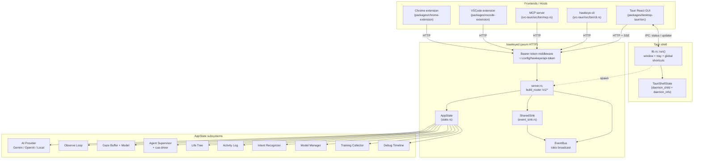
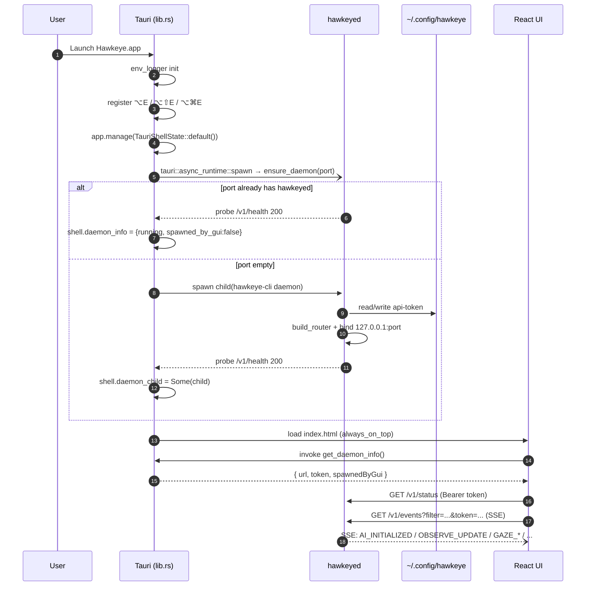
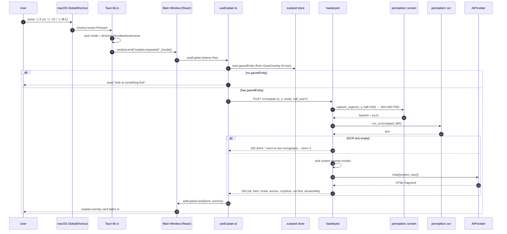
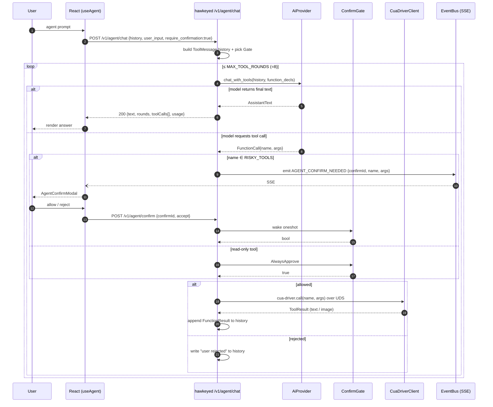
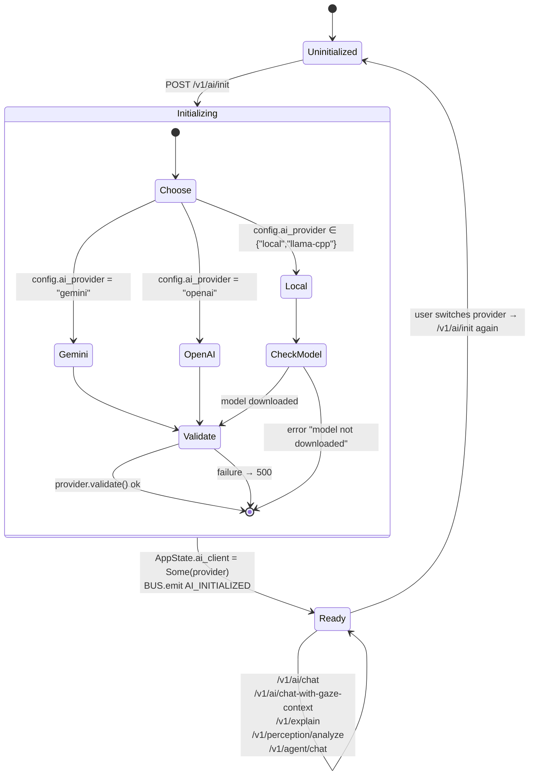
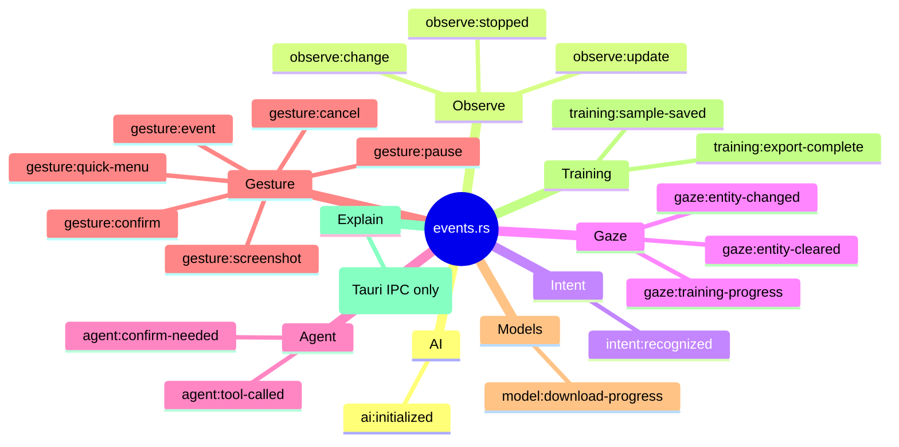

<div align="center">



# Hawkeye

**AI that enhances your story. Watch keenly. Act thoughtfully. 10x your productivity.**

[](https://github.com/tensorboy/hawkeye)
[](LICENSE)
[](https://github.com/tensorboy/hawkeye/releases)

[🌐 Website](https://hawkiyi.com) · [📖 Documentation](https://hawkiyi.com/docs) · [🐛 Report Bug](https://github.com/tensorboy/hawkeye/issues) · [💡 Request Feature](https://github.com/tensorboy/hawkeye/issues)

<br/>


</div>

<br/>

---

## 🎯 What is Hawkeye?

> **Traditional AI waits for your commands. Hawkeye watches and helps proactively.**

Hawkeye is an **AI-powered desktop assistant** that observes your work environment—screen, clipboard, files—and proactively offers intelligent suggestions. No prompts needed.

The AI behind Hawkeye is designed to **enhance your own story** — turning your screen time into meaningful personal growth by automatically mapping your goals, habits, and progress into a living **Life Tree**.

| Feature | Copilot / Cursor / Claude Code | **Hawkeye** |
|---------|-------------------------------|-------------|
| **Mode** | Reactive (you ask) | **Proactive** (it watches) |
| **Scope** | Code only | Everything: coding, browsing, writing |
| **Privacy** | Cloud-based | **Local-first**, your data stays local |
| **Control** | AI executes | **You decide** what to execute |

<br/>

<p align="center"></p>

## ✨ Key Features

<table>
<tr>
<td width="50%">

### 🔍 Zero-Prompt Intelligence
- Automatically understands your context
- No need to explain what you're doing
- Suggests actions before you ask

</td>
<td width="50%">

### 🏠 Privacy-First Architecture
- All perception runs **100% locally**
- Data never leaves your device
- Works offline with local LLMs

</td>
</tr>
<tr>
<td width="50%">

### 🎯 Smart Task Tracking
- Identifies your main task goal
- Generates actionable next steps
- Learns from your workflow

</td>
<td width="50%">

### 🔗 Multi-Platform Sync
- Desktop ↔ Browser seamless sync
- VS Code extension integration
- Cross-app workflow automation

</td>
</tr>
<tr>
<td colspan="2">

### 🌳 Life Tree — AI Enhances Your Story
- Automatically maps your activities into life stages, goals, and tasks
- Proposes micro-experiments to optimize your habits and workflows
- Graduated experiment phases: task → goal → automation
- Your AI companion that turns screen time into personal growth

</td>
</tr>
</table>

<br/>

## 🚀 Quick Start

### Download

<table>
<tr>
<th>Platform</th>
<th>Download</th>
</tr>
<tr>
<td></td>
<td>

[Apple Silicon (.dmg)](https://github.com/tensorboy/hawkeye/releases/latest) · [Intel (.dmg)](https://github.com/tensorboy/hawkeye/releases/latest)

</td>
</tr>
<tr>
<td></td>
<td>

[Installer (.exe)](https://github.com/tensorboy/hawkeye/releases/latest)

</td>
</tr>
<tr>
<td></td>
<td>

[Debian/Ubuntu (.deb)](https://github.com/tensorboy/hawkeye/releases/latest) · [AppImage](https://github.com/tensorboy/hawkeye/releases/latest)

</td>
</tr>
</table>

<details>
<summary><b>⚠️ macOS: "App is damaged" fix</b></summary>

```bash
# Remove quarantine attribute
xattr -cr /Applications/Hawkeye.app
```

</details>

### Setup in 60 Seconds

```bash
# 1. Clone
git clone https://github.com/tensorboy/hawkeye.git && cd hawkeye

# 2. Install
pnpm install

# 3. Run
pnpm dev
```

### Configure AI Provider

<details>
<summary><b>Option 1: Google Gemini (Recommended — free tier)</b></summary>

1. Get a free API key at [aistudio.google.com/apikey](https://aistudio.google.com/apikey)
2. Enter your key in Settings → Gemini API Key
3. Model defaults to `gemini-2.0-flash` (1M context window)

</details>

<details>
<summary><b>Option 2: OpenAI-Compatible API</b></summary>

Works with OpenAI, DeepSeek, Groq, Together AI, or any OpenAI-compatible endpoint.

Set your base URL, API key, and model name in Settings.

</details>

<details>
<summary><b>Option 3: Local LLM with node-llama-cpp (100% Offline)</b></summary>

Download a GGUF model and set the model path in Settings. Supports Metal GPU acceleration on macOS.

Recommended models:
- **Qwen 2.5 7B** — general purpose (4.7 GB)
- **Llama 3.2 3B** — lightweight (2.0 GB)
- **LLaVA 1.6 7B** — vision support (4.5 GB)

</details>

<details>
<summary><b>Option 4: Ollama (Legacy)</b></summary>

```bash
brew install ollama && ollama pull qwen3:8b
```

Select "Ollama" in Hawkeye settings.

</details>

<br/>

<p align="center"></p>

## 🏗️ Architecture

```
┌─────────────────────────────────────────────────────────────────┐
│                        HAWKEYE ENGINE                           │
├─────────────────────────────────────────────────────────────────┤
│                                                                 │
│  ┌─────────────┐    ┌─────────────┐    ┌─────────────┐         │
│  │  PERCEPTION │───▶│  REASONING  │───▶│  EXECUTION  │         │
│  │   Engine    │    │   Engine    │    │   Engine    │         │
│  └─────────────┘    └─────────────┘    └─────────────┘         │
│        │                  │                  │                  │
│   • Screen OCR      • Claude/Ollama     • Shell Commands       │
│   • Clipboard       • Task Analysis     • File Operations      │
│   • File Watch      • Intent Detect     • App Control          │
│   • Window Track    • Suggestions       • Browser Auto         │
│                                                                 │
├─────────────────────────────────────────────────────────────────┤
│                         INTERFACES                              │
├───────────────┬───────────────┬───────────────┬─────────────────┤
│   🖥️ Desktop   │  🧩 VS Code    │  🌐 Chrome     │    📦 Core      │
│   (Electron)  │  Extension    │  Extension    │    (npm pkg)    │
└───────────────┴───────────────┴───────────────┴─────────────────┘
```

### 🔮 Future: Multi-Modal HCI Pipeline

Hawkeye is evolving into a full multi-modal human-computer interaction system that combines **audio understanding**, **visual perception**, and **gesture control**.

```
┌─────────────────────────────────────────────────────────────────────────────┐
│                    HAWKEYE MULTI-MODAL HCI PIPELINE                          │
├─────────────────────────────────────────────────────────────────────────────┤
│                                                                              │
│   ┌─────────────────────────────────────────────────────────────────────┐   │
│   │                         INPUT LAYER                                  │   │
│   ├─────────────────────────────────────────────────────────────────────┤   │
│   │  📷 Camera ────▶ MediaPipe Holistic                                 │   │
│   │                  • Face: 468 landmarks                              │   │
│   │                  • Pose: 33 keypoints                               │   │
│   │                  • Hands: 21 × 2 keypoints                          │   │
│   │                                                                      │   │
│   │  🎙️ Microphone ─▶ Silero VAD ─▶ Audio Buffer                        │   │
│   └─────────────────────────────────────────────────────────────────────┘   │
│                              │                │                              │
│                              ▼                ▼                              │
│   ┌──────────────────────────────┐  ┌──────────────────────────────────┐   │
│   │      VISUAL PROCESSING       │  │      AUDIO PROCESSING            │   │
│   ├──────────────────────────────┤  ├──────────────────────────────────┤   │
│   │  Face Tracker                │  │  DiariZen / Pyannote             │   │
│   │  ├─ Multi-face detection     │  │  ├─ Speaker diarization          │   │
│   │  ├─ Face ID assignment       │  │  ├─ "Who is speaking?"           │   │
│   │  └─ Lip movement analysis    │  │  └─ Speaker embeddings           │   │
│   │                              │  │                                   │   │
│   │  Gesture Recognizer          │  │  Whisper (smart-whisper)         │   │
│   │  ├─ Hand pose classification │  │  ├─ Speech-to-text               │   │
│   │  ├─ Dynamic gesture detect   │  │  ├─ Language detection           │   │
│   │  └─ Custom gesture mapping   │  │  └─ Timestamp alignment          │   │
│   └──────────────────────────────┘  └──────────────────────────────────┘   │
│                              │                │                              │
│                              ▼                ▼                              │
│   ┌─────────────────────────────────────────────────────────────────────┐   │
│   │                    FUSION & MATCHING LAYER                           │   │
│   ├─────────────────────────────────────────────────────────────────────┤   │
│   │                                                                      │   │
│   │   Audio-Visual Matching                                             │   │
│   │   ├─ Lip-sync correlation (who's lips match the audio?)            │   │
│   │   ├─ Face-voice association (learn speaker identity)               │   │
│   │   └─ Active speaker detection (LoCoNet / AS-Net)                   │   │
│   │                                                                      │   │
│   │   Context Aggregation                                               │   │
│   │   ├─ Combine: transcription + speaker ID + face ID + gesture       │   │
│   │   └─ Generate unified interaction events                           │   │
│   │                                                                      │   │
│   └─────────────────────────────────────────────────────────────────────┘   │
│                                      │                                       │
│                                      ▼                                       │
│   ┌─────────────────────────────────────────────────────────────────────┐   │
│   │                       ACTION EXECUTION                               │   │
│   ├─────────────────────────────────────────────────────────────────────┤   │
│   │                                                                      │   │
│   │   Gesture → Command Mapping                                         │   │
│   │   ├─ 👍 Thumbs Up     → Confirm action                             │   │
│   │   ├─ ✋ Open Palm     → Pause / Stop                                │   │
│   │   ├─ 👆 Point Up      → Scroll up                                   │   │
│   │   ├─ 👇 Point Down    → Scroll down                                 │   │
│   │   ├─ ✌️ Victory       → Screenshot                                  │   │
│   │   ├─ 🤏 Pinch        → Zoom in/out                                  │   │
│   │   └─ 🖐️ Swipe        → Switch window / tab                         │   │
│   │                                                                      │   │
│   │   Voice Command + Gesture = Enhanced Control                        │   │
│   │   └─ "Open browser" + Point → Open browser at pointed location     │   │
│   │                                                                      │   │
│   └─────────────────────────────────────────────────────────────────────┘   │
│                                      │                                       │
│                                      ▼                                       │
│   ┌─────────────────────────────────────────────────────────────────────┐   │
│   │                         OUTPUT                                       │   │
│   ├─────────────────────────────────────────────────────────────────────┤   │
│   │                                                                      │   │
│   │   📝 Attributed Transcription                                       │   │
│   │      "Alice: Let's review the code changes"                         │   │
│   │      "Bob: I'll share my screen [👆 pointing at screen]"            │   │
│   │                                                                      │   │
│   │   🎮 System Control                                                 │   │
│   │      Mouse movement, clicks, keyboard shortcuts, app switching      │   │
│   │                                                                      │   │
│   │   🌳 Life Tree Update                                               │   │
│   │      Activity tracking, goal inference, habit analysis              │   │
│   │                                                                      │   │
│   └─────────────────────────────────────────────────────────────────────┘   │
│                                                                              │
└─────────────────────────────────────────────────────────────────────────────┘
```

**Key Technologies:**
| Component | Technology | Status |
|-----------|------------|--------|
| Voice Activity Detection | Silero VAD | ✅ Planned |
| Speech-to-Text | Whisper (smart-whisper) | ✅ Implemented |
| Speaker Diarization | DiariZen / Pyannote | 🔄 Research |
| Active Speaker Detection | LoCoNet (CVPR 2024) | 🔄 Research |
| Body Tracking | MediaPipe Holistic | ✅ Planned |
| Gesture Recognition | MediaPipe Gesture | ✅ Planned |
| Face-Voice Matching | Custom Fusion | 🔄 Research |

<br/>

## 📦 Project Structure

```
hawkeye/
├── packages/
│   ├── core/                 # 🧠 Core engine (local processing)
│   │   ├── perception/       #    Screen, clipboard, file monitoring
│   │   ├── ai/               #    AI providers (Claude, Ollama, etc.)
│   │   ├── execution/        #    Action execution system
│   │   └── storage/          #    Local database (SQLite)
│   │
│   ├── desktop/              # 🖥️  Electron desktop app
│   ├── vscode-extension/     # 🧩 VS Code extension
│   └── chrome-extension/     # 🌐 Chrome browser extension
│
├── docs/                     # 📖 Documentation
└── website/                  # 🌐 Marketing site
```

<br/>

## 🔒 Privacy & Security

| Aspect | How We Protect You |
|--------|-------------------|
| **Screenshots** | ✅ Analyzed locally, never uploaded |
| **Clipboard** | ✅ Processed on-device only |
| **Files** | ✅ Monitored locally, paths never sent |
| **AI Calls** | ✅ Only minimal context text sent (or use local LLM) |
| **Dangerous Ops** | ✅ Always requires your confirmation |

> 📁 All data stored in `~/.hawkeye/` — you own your data.

<br/>

## 📖 Usage Examples

### As a Library

```typescript
import { HawkeyeEngine } from '@hawkeye/core';

const engine = new HawkeyeEngine({
  provider: 'ollama',
  model: 'qwen3:8b'
});

// Get AI-powered suggestions based on current context
const suggestions = await engine.observe();

// Execute a suggestion with user confirmation
await engine.execute(suggestions[0].id);
```

### File Watcher

```typescript
import { FileWatcher } from '@hawkeye/core';

const watcher = new FileWatcher({
  paths: ['~/Downloads', '~/Documents'],
  events: ['create', 'move']
});

watcher.on('change', (event) => {
  console.log(`${event.type}: ${event.path}`);
});
```

<br/>

## 🛡️ Advanced Features

### Exponential Backoff Retry
AI provider calls use exponential backoff with jitter to handle transient failures gracefully, preventing thundering herd effects.

### SQLite FTS5 Full-Text Search
Context history (window titles, clipboard, OCR text) is indexed with SQLite FTS5 for instant fuzzy search across all recorded observations.

### Adaptive Refresh Rate
The observation interval adjusts dynamically based on user activity — fast polling when active, slow polling when idle — saving CPU and battery.

### Priority Task Queue
A priority-based task queue with deduplication ensures that AI requests and plan executions are processed efficiently without duplicate work.

### MCP Server Tools
Hawkeye exposes 15+ tools via MCP (Model Context Protocol) for screen perception, window management, file organization, and automation.

### Safety Guardrails
An agent monitor enforces cost limits, blocks dangerous operations (e.g. `rm -rf /`), requires confirmation for risky actions, and supports a sandbox mode.

### Menu Bar Panel
A macOS-style popover panel accessible from the system tray provides quick actions, recent activity feed, and real-time module status indicators.

### Provider Unified Protocol
All AI providers declare their capabilities (chat, vision, streaming, function calling), enabling intelligent routing and health monitoring across providers.

<br/>

<p align="center"></p>

## 🗺️ Roadmap

- [x] Core perception engine
- [x] Desktop app (Electron)
- [x] VS Code extension
- [x] Chrome extension
- [x] Local LLM support (Ollama, node-llama-cpp)
- [x] Multi-provider AI (Gemini, OpenAI-compatible, LlamaCpp)
- [x] Provider unified protocol with capability routing
- [x] Streaming and health check support
- [x] SQLite FTS5 full-text search
- [x] Exponential backoff retry strategy
- [x] Adaptive refresh rate
- [x] Priority task queue
- [x] MCP Server with 15+ tools
- [x] Safety guardrails and agent monitoring
- [x] Menu bar panel (macOS-style popover)
- [x] Life Tree — AI maps your life journey and enhances your story
- [ ] Desktop ↔ Extension real-time sync
- [ ] Plugin system
- [ ] Custom workflow builder
- [ ] Mobile companion app

<br/>

## 🤝 Contributing

Contributions are what make the open source community amazing! Any contributions you make are **greatly appreciated**.

1. Fork the Project
2. Create your Feature Branch (`git checkout -b feature/AmazingFeature`)
3. Commit your Changes (`git commit -m 'Add some AmazingFeature'`)
4. Push to the Branch (`git push origin feature/AmazingFeature`)
5. Open a Pull Request

See [CONTRIBUTING.md](CONTRIBUTING.md) for detailed guidelines.

<br/>

## 🏗️ Architecture & Flow

> All diagrams are written in [Mermaid](https://mermaid.js.org/) and render natively on GitHub. For a renderer that also outputs ASCII (great for terminals & LLM prompts) see [beautiful-mermaid](https://github.com/lukilabs/beautiful-mermaid). The standalone [HAWKEYE_FLOW.md](HAWKEYE_FLOW.md) keeps every diagram in one place.

### Top-level component map

After the *HAWKEYED unification*, Tauri is a thin shell (window / tray / global shortcuts) and every backend capability lives in a standalone `hawkeyed` HTTP daemon. Any frontend — GUI, CLI, MCP server, VSCode / Chrome extensions — talks to the same `AppState` over `localhost:<port>` REST + SSE.



### Boot & daemon handshake



### Observe loop (adaptive + perception fan-in)

```mermaid
flowchart TD
  Start([POST /v1/observe/start]) --> Spawn[tokio::spawn run_loop]
  Spawn --> AdaptInt[read adaptive_refresh.current_interval_ms]
  AdaptInt --> Sleep{select! sleep | stop_rx}
  Sleep -- stop --> Emit0[sink.emit OBSERVE_STOPPED] --> End([return])
  Sleep -- tick --> Cap[perception::screen::capture_screenshot]
  Cap -->|Err| AdaptInt
  Cap --> Decode[base64 → PNG → RGBA]
  Decode --> Hash[change_detector::compute_phash 8x8 avg]
  Hash --> Cmp{change_ratio ≥ threshold?}
  Cmp -- no --> AdaptInt
  Cmp -- yes --> EmitChg[sink.emit OBSERVE_CHANGE]
  EmitChg --> Rec[adaptive_refresh.record_activity ScreenChange]
  Rec --> Win[perception::window::get_active_window]
  Win --> OCR[perception::ocr::run_ocr<br/>Vision API via swift-ocr]
  OCR --> Build[assemble ObservationResult<br/>+ ocr_regions for gaze hit-test]
  Build --> Log[activity_log.push ActivityEntry]
  Log --> Intent[intent_recognizer.recognize]
  Intent --> IntentE{any intents?}
  IntentE -- yes --> EmitInt[sink.emit INTENT_RECOGNIZED]
  IntentE -- no --> Tree
  EmitInt --> Tree
  Tree[life_tree.process_activity] --> Store[state.last_observation = obs]
  Store --> EmitObs[sink.emit OBSERVE_UPDATE]
  EmitObs --> AdaptInt
```

### Look-to-Explain (`⌥E` / `⌥⇧E` / `⌥⌘E`)

Hawkeye's signature interaction: hold your gaze on something, press one of the three explain hotkeys, and a card pops up with a *dictionary* / *troubleshoot* / *scene* explanation rendered as inline HTML.



### Gaze tracking & online training

```mermaid
graph LR
  subgraph FE[React frontend]
    WG[WebGazer<br/>MediaPipe WASM]
    HG[useWebGazer.ts]
    HE[useGazedEntity.ts]
    OV[GazeOverlay.tsx]
  end

  subgraph D[hawkeyed]
    SB[POST /v1/gaze/sample<br/>→ GazeDataBuffer]
    PR[POST /v1/gaze/predict<br/>→ GazeModel.predict_timed]
    TR[POST /v1/gaze/train<br/>→ tokio::spawn run_training]
    AR[ane_runner.rs<br/>ANE > CPU fallback]
    GM[GazeModel<br/>(state.gaze_model)]
    ENT[PUT /v1/gaze/entity<br/>state.current_gazed_entity]
    CCG[POST /v1/ai/chat-with-gaze-context]
    OBS[state.last_observation<br/>ocr_regions]
  end

  WG -->|40-d features| HG
  HG -->|continuous stream| SB
  HG -->|each frame| PR
  PR -->|(x,y)| OV
  OBS -.snapshot.-> HE
  OV --> HE
  HE -->|hit OCR region| ENT
  ENT --> CCG
  CCG -. rewrite "this/that" .- ENT

  SB -. enough samples .- TR
  TR --> AR
  AR --> GM
  GM --> PR
```

```mermaid
stateDiagram-v2
  [*] --> Empty: first launch
  Empty --> Buffering: POST /v1/gaze/sample
  Buffering --> Buffering: sample_count < 10
  Buffering --> Ready: ≥10 and not training
  Ready --> Training: POST /v1/gaze/train
  Training --> Ready: ANE done, model updated
  Training --> Ready: failure (log::error, old model kept)
  Ready --> Predicting: POST /v1/gaze/predict
  Predicting --> Ready
  Ready --> Empty: DELETE /v1/gaze/model
```

### Agent tool loop (cua-driver, multi-round)

`run_user_turn` orchestrates a single user turn through `chat_with_tools`. Risky tools (`click`, `type_text`, `press_key`, `launch_app`, `scroll`) go through a `ConfirmGate`; in the GUI that fires `agent:confirm-needed` on the SSE bus and waits up to 30 s for the user to click in `AgentConfirmModal`. Tool results are fed back to the model up to `MAX_TOOL_ROUNDS = 8`.



### AI Provider abstraction



### End-to-end: from pixels to answer

```mermaid
flowchart TD
  subgraph Sense[Sense]
    SCR[screen capture] --> PH[perceptual hash]
    PH -->|changed| OCR2[OCR + regions]
    SCR --> CROP[capture_region<br/>fixed 400×400]
  end

  subgraph Track[Track]
    EYE[WebGazer features] --> SAM[/v1/gaze/sample]
    SAM --> BUF[GazeBuffer]
    BUF --> TRN[/v1/gaze/train<br/>ANE]
    TRN --> GM2[GazeModel]
    EYE --> PRED[/v1/gaze/predict]
    PRED --> XY[(x, y)]
  end

  subgraph Fuse[Fuse]
    OCR2 --> REG[ocr_regions]
    XY --> HIT[frontend hit-test]
    REG --> HIT
    HIT --> ENT[GazedEntity<br/>{text, type, bbox}]
  end

  subgraph Act[Act]
    ENT --> CHAT["/v1/ai/chat-with-gaze-context<br/>rewrite this/that"]
    ENT --> EXP["⌥E → /v1/explain<br/>crop + OCR + AI"]
    ENT --> AGT2["/v1/agent/chat<br/>screen-aware tools"]
    CHAT --> OUT[(answer)]
    EXP --> OUT
    AGT2 --> OUT
  end
```

### Event bus (SSE) topics



### One picture: all entries → all exits

```mermaid
graph TB
  classDef ent fill:#3b82f6,color:#fff
  classDef daemon fill:#10b981,color:#fff
  classDef store fill:#f59e0b,color:#fff
  classDef out fill:#ef4444,color:#fff

  subgraph IN[Entries]
    K1["⌥E / ⌥⇧E / ⌥⌘E"]:::ent
    K2[Tray menu]:::ent
    K3[React chat box]:::ent
    K4[Agent input]:::ent
    K5[GazeOverlay focus]:::ent
    K6[hawkeye-cli ask]:::ent
    K7[MCP client]:::ent
    K8[Chrome ext]:::ent
  end

  subgraph DA[hawkeyed]
    R1[/v1/explain]:::daemon
    R2[/v1/ai/chat]:::daemon
    R3[/v1/ai/chat-with-gaze-context]:::daemon
    R4[/v1/agent/chat]:::daemon
    R5[/v1/observe/*]:::daemon
    R6[/v1/gaze/*]:::daemon
    R7[/v1/perception/*]:::daemon
    R8[/v1/life-tree/*]:::daemon
    R9[/v1/summary/generate]:::daemon
    R10[/v1/events SSE]:::daemon
  end

  subgraph ST[AppState]
    S1[ai_client]:::store
    S2[observe_loop]:::store
    S3[gaze_model + buffer]:::store
    S4[current_gazed_entity]:::store
    S5[activity_log]:::store
    S6[life_tree]:::store
    S7[debug_timeline]:::store
    S8[agent_supervisor]:::store
  end

  subgraph OUT[Exits]
    O1[explain-overlay HTML]:::out
    O2[Chat bubble]:::out
    O3[Agent tool exec + answer]:::out
    O4[Life Tree viz]:::out
    O5[Activity Summary]:::out
    O6[SSE event stream]:::out
    O7[Training samples JSONL]:::out
  end

  K1 --> R1
  K2 --> R5
  K3 --> R2
  K3 --> R3
  K4 --> R4
  K5 --> R6
  K6 --> R2
  K7 --> R2
  K7 --> R4
  K8 --> R7

  R1 --> S1 --> O1
  R2 --> S1 --> O2
  R3 --> S4
  R3 --> S1 --> O2
  R4 --> S1
  R4 --> S8 --> O3
  R5 --> S2 --> S5
  R5 --> S6
  R6 --> S3
  R6 --> S4
  R7 --> S1
  R8 --> S6 --> O4
  R9 --> S5 --> O5
  R5 -. emit .-> R10 --> O6
  R4 -. tool_called .-> R10
  R6 -. training-progress .-> R10
  R4 -. save .-> O7
```

<br/>

## ⭐ Star History

<a href="https://star-history.com/#tensorboy/hawkeye&Date">
 <picture>
   <source media="(prefers-color-scheme: dark)" srcset="https://api.star-history.com/svg?repos=tensorboy/hawkeye&type=Date&theme=dark" />
   <source media="(prefers-color-scheme: light)" srcset="https://api.star-history.com/svg?repos=tensorboy/hawkeye&type=Date" />
   
 </picture>
</a>

<br/>

## 📄 License

Distributed under the MIT License. See [LICENSE](LICENSE) for more information.

<br/>

## ☕ Support

<div align="center">

If you find Hawkeye useful, consider buying me a coffee!

<a href="https://buymeacoffee.com/7xyxbngjf1">
  
</a>

<br/><br/>


</div>

<br/>

---

<div align="center">

**[🌐 Website](https://hawkiyi.com)** · **[📖 Docs](https://hawkiyi.com/docs)** · **[🐦 Twitter](https://twitter.com/hawkeyeai)** · **[💬 Discord](https://discord.gg/hawkeye)**

<sub>Built with ❤️ by the Hawkeye Team</sub>

<br/>

**If Hawkeye helps you, please consider giving it a ⭐**

</div>

<p align="center"></p>
